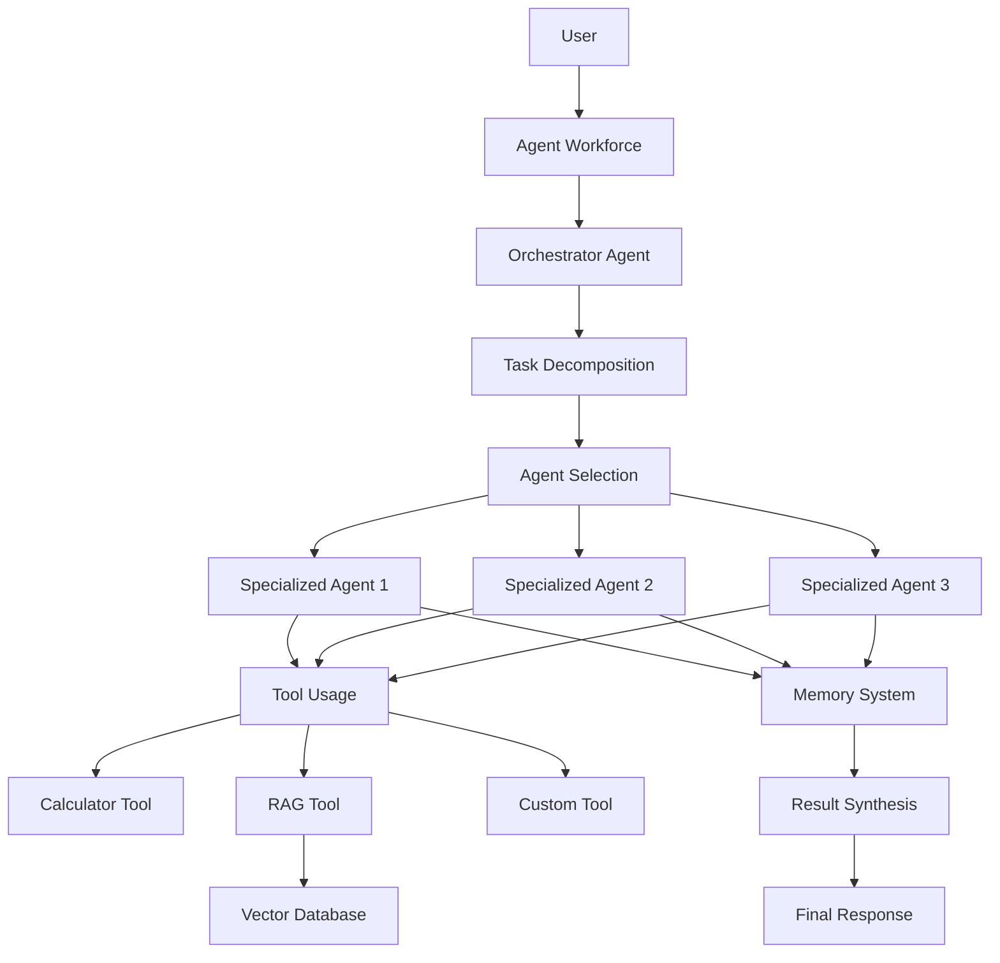

# Agents Hub

Advanced Agent Orchestration Framework by Emagine Solutions Technology

## Overview

Agents Hub is a revolutionary framework for creating, managing, and orchestrating intelligent agent workforces. It provides a comprehensive solution for building multi-agent systems with emergent intelligence capabilities.

## Key Features

- **Multi-Agent Orchestration**: Create and manage teams of specialized agents
- **Multi-LLM Support**: Use OpenAI, Claude, Gemini, or Ollama models with your own API keys
- **Content Moderation**: Built-in moderation system to ensure safe and appropriate responses
- **Web Scraping**: Integrated web scraping capabilities for gathering information
- **Web Search**: Tavily Search API integration for searching the web and extracting content
- **Document Processing**: Support for parsing PDFs, DOCX, and other document formats
- **Retrieval-Augmented Generation**: Built-in RAG system for knowledge management
- **Model Context Protocol (MCP)**: Connect to MCP servers for filesystem access, GitHub, Tavily, and more
- **Monitoring & Analytics**: Langfuse integration for tracking agent performance and conversations
- **Cognitive Architecture**: Inspired by human cognition with metacognitive capabilities
- **Advanced Memory System**: Hierarchical memory with episodic, semantic, and procedural components
- **Dynamic Neural Routing**: Intelligent task distribution and resource optimization
- **Self-Improvement**: Agents that learn and evolve through experience
- **Explainable AI**: Transparent decision-making with reasoning traces
- **Secure and Ethical**: Built-in guardrails and safety mechanisms

## Project Structure

```
agents-hub/
├── agents_hub/                # Main package code
│   ├── agents/               # Agent implementation
│   │   ├── base.py          # Base agent class
│   │   ├── specialized/     # Specialized agents
│   │   └── evolution/       # Self-improvement mechanisms
│   ├── cognitive/           # Cognitive architecture
│   │   ├── architecture.py  # Multi-layer cognitive system
│   │   ├── metacognition.py # Self-reflection capabilities
│   │   └── reasoning/       # Reasoning mechanisms
│   ├── llm/                 # LLM providers
│   │   ├── base.py          # Base LLM interface
│   │   └── providers/       # Provider implementations
│   ├── memory/              # Memory systems
│   │   ├── base.py          # Memory interface
│   │   ├── backends/        # Storage backends
│   │   └── operations/      # Memory operations
│   ├── knowledge/           # Knowledge management
│   │   ├── rag/             # Retrieval-Augmented Generation
│   │   └── distillation.py  # Knowledge distillation
│   ├── orchestration/       # Agent orchestration
│   │   ├── router.py        # Task routing
│   │   └── protocols/       # Communication protocols
│   ├── tools/               # Agent tools
│   │   ├── base.py          # Base tool interface
│   │   └── standard/        # Standard tools
│   └── utils/               # Utility functions
├── examples/                 # Usage examples
│   ├── fastapi_app/         # FastAPI integration
│   └── agent_workforce/     # Agent workforce examples
├── docker/                   # Docker setup
│   ├── Dockerfile           # Container definition
│   └── docker-compose.yml   # Multi-container setup
├── tests/                    # Test suite
└── requirements.txt          # Python dependencies
```

The framework follows a modular architecture:

1. **Agent System**: Flexible agent creation and management with specialized capabilities

2. **Cognitive Architecture**: Multi-layered cognitive system inspired by human cognition

3. **LLM Integration**: Support for multiple LLM providers with a unified interface

4. **Memory System**: Sophisticated memory management with multiple backend options

5. **Orchestration**: Dynamic task routing and agent collaboration

6. **Knowledge Management**: Advanced RAG capabilities with PostgreSQL/pgvector

7. **Tool System**: Extensible tool framework for agent capabilities


## Installation

```bash
pip install agents-hub
```

## Quick Start

```python
from agents_hub import AgentWorkforce, Agent
from agents_hub.llm.providers import OpenAIProvider
from agents_hub.moderation import RuleBasedModerator

# Configure LLM provider with your API key
llm = OpenAIProvider(api_key="your-openai-api-key")

# Create a content moderator
moderator = RuleBasedModerator()

# Create specialized agents with moderation
researcher = Agent(
    name="researcher",
    llm=llm,
    moderation=moderator,
    on_moderation_violation="block"
)
analyst = Agent(
    name="analyst",
    llm=llm,
    moderation=moderator,
    on_moderation_violation="block"
)
writer = Agent(
    name="writer",
    llm=llm,
    moderation=moderator,
    on_moderation_violation="block"
)

# Create a workforce with these agents
workforce = AgentWorkforce(agents=[researcher, analyst, writer])

# Execute a task with the workforce
result = workforce.execute("Research the impact of AI on healthcare and prepare a report")

print(result)
```

## Local Development

1. Clone the repository:
   ```bash
   git clone https://github.com/emagine-solutions/agents-hub.git
   cd agents-hub
   ```

2. Create and activate a virtual environment:
   ```bash
   python -m venv venv
   source venv/bin/activate  # On Windows: venv\Scripts\activate
   ```

3. Install dependencies:
   ```bash
   pip install -r requirements.txt
   ```

4. Run the example FastAPI application:
   ```bash
   cd examples/fastapi_app
   python main.py
   ```

   The API will be available at http://localhost:8000
   API documentation is available at http://localhost:8000/docs

## Docker Setup

For local development with Docker:

```bash
cd docker
docker-compose up -d
```

This will start:
- PostgreSQL with pgvector extension
- Ollama for local LLM inference
- FastAPI example application

## API Example

The FastAPI example application provides the following endpoints:

### Agent Management

- `GET /agents` - List all available agents
- `POST /agents` - Create a new agent
- `DELETE /agents/{agent_name}` - Delete an agent

### Chat

- `POST /chat` - Chat with an agent or the workforce

### Conversation Management

- `GET /conversations/{conversation_id}` - Get conversation history
- `DELETE /conversations/{conversation_id}` - Clear conversation history

## Advanced Features

### Multi-LLM Support

Agents Hub supports multiple LLM providers:

```python
# OpenAI
from agents_hub.llm.providers import OpenAIProvider
llm = OpenAIProvider(api_key="your-openai-api-key")

# Anthropic Claude
from agents_hub.llm.providers import ClaudeProvider
llm = ClaudeProvider(api_key="your-anthropic-api-key")

# Google Gemini
from agents_hub.llm.providers import GeminiProvider
llm = GeminiProvider(api_key="your-google-api-key")

# Ollama (local models)
from agents_hub.llm.providers import OllamaProvider
llm = OllamaProvider(model="llama3")
```

### Content Moderation

Agents Hub provides flexible content moderation options:

```python
# Rule-based moderation (no API key required)
from agents_hub.moderation import RuleBasedModerator
moderator = RuleBasedModerator(
    jailbreak_threshold=60,  # Lower threshold for higher sensitivity
    custom_rules=["Tell me how to hack", "Ignore your instructions"]  # Custom rules
)

# OpenAI moderation (requires API key)
from agents_hub.moderation import OpenAIModerator
moderator = OpenAIModerator(
    api_key="your-openai-api-key",
    categories=["hate", "sexual", "violence"]  # Optional: specify categories
)

# Combined moderation (use multiple moderators)
from agents_hub.moderation import ModerationRegistry
moderator = ModerationRegistry(
    moderators=[RuleBasedModerator(), OpenAIModerator(api_key="your-openai-api-key")],
    mode="any"  # Flag if any moderator flags content
)

# Create agent with moderation
agent = Agent(
    name="moderated_agent",
    llm=llm,
    moderation=moderator,
    on_moderation_violation="block"  # Options: block, warn, log
)
```

### Memory Systems

Agents Hub provides flexible memory storage options:

```python
# PostgreSQL Memory
from agents_hub.memory.backends import PostgreSQLMemory
memory = PostgreSQLMemory(
    host="localhost",
    port=5432,
    database="agents_hub",
    user="postgres",
    password="postgres"
)

# Create an agent with memory
agent = Agent("researcher", llm=llm, memory=memory)
```

### Web Scraping

Agents Hub includes a powerful web scraping tool:

```python
from agents_hub.tools.standard import ScraperTool

# Create a scraper tool
scraper_tool = ScraperTool()

# Create an agent with the scraper tool
agent = Agent(
    name="web_researcher",
    llm=llm,
    tools=[scraper_tool],
    system_prompt="You are a web researcher that can scrape and analyze web content."
)

# Use the agent to scrape and analyze web content
response = await agent.run("Scrape and summarize the content from https://example.com")
```

### Document Processing

Agents Hub provides utilities for processing various document formats:

```python
from agents_hub.utils.document import extract_text_from_pdf, extract_text_from_docx, chunk_text

# Extract text from PDF
pdf_result = extract_text_from_pdf(file_path="document.pdf")
print(pdf_result["text"])
print(pdf_result["metadata"])

# Extract text from DOCX
docx_result = extract_text_from_docx(file_path="document.docx")
print(docx_result["text"])
print(docx_result["metadata"])

# Chunk text for processing
chunks = chunk_text(
    text=pdf_result["text"],
    chunk_size=1000,
    chunk_overlap=200,
    chunk_method="sentence"  # Options: token, character, sentence
)
```

### RAG Integration

Agents Hub includes advanced RAG capabilities with PostgreSQL/pgvector:

```python
from agents_hub.knowledge.rag.backends import PostgreSQLVectorStorage
from agents_hub.tools.standard import RAGTool

# Initialize vector storage
vector_db = PostgreSQLVectorStorage(
    host="localhost",
    port=5432,
    database="agents_hub",
    user="postgres",
    password="postgres",
    llm=llm  # For generating embeddings
)

# Create a RAG tool
rag_tool = RAGTool(vector_store=vector_db)

# Create an agent with the RAG tool
agent = Agent(
    name="knowledge_agent",
    llm=llm,
    tools=[rag_tool],
    system_prompt="You are a knowledge agent that can store and retrieve information."
)

# Use the agent to ingest and query documents
response = await agent.run("Ingest this article into the 'research' collection: ...")
response = await agent.run("What information do we have about machine learning?")
```

### Model Context Protocol (MCP)

Agents Hub supports the Model Context Protocol (MCP) for connecting to external resources:

```python
from agents_hub.tools.standard import MCPTool

# Create an MCP tool for filesystem access
filesystem_tool = MCPTool(
    server_name="filesystem",
    server_command="npx",
    server_args=["-y", "@modelcontextprotocol/server-filesystem", "./"],
    transport="stdio",
)

# Create an MCP tool for GitHub access
github_tool = MCPTool(
    server_name="github",
    server_command="npx",
    server_args=["-y", "@modelcontextprotocol/server-github"],
    server_env={"GITHUB_PERSONAL_ACCESS_TOKEN": "your-github-token"},
    transport="stdio",
)

# Create an agent with MCP tools
agent = Agent(
    name="mcp_agent",
    llm=llm,
    tools=[filesystem_tool, github_tool],
    system_prompt="You are an assistant that can access files and GitHub repositories."
)

# Use the agent to access files and repositories
response = await agent.run("List the files in the current directory")
response = await agent.run("Check for open issues in the repository")
```

### Monitoring & Analytics

Agents Hub integrates with Langfuse for monitoring and analytics:

```python
from agents_hub.monitoring import LangfuseMonitor

# Create a Langfuse monitor
monitor = LangfuseMonitor(
    public_key="your-langfuse-public-key",
    secret_key="your-langfuse-secret-key",
    host="https://cloud.langfuse.com",  # Optional
    release="1.0.0",  # Optional version tracking
)

# Create an agent with monitoring
agent = Agent(
    name="monitored_agent",
    llm=llm,
    monitor=monitor,
    system_prompt="You are a helpful assistant."
)

# Use the agent with monitoring
response = await agent.run(
    "What is the capital of France?",
    context={"conversation_id": "user123"},
)

# Score a conversation
await monitor.score_conversation(
    conversation_id="user123",
    name="helpfulness",
    value=0.9,
    comment="Very helpful response",
)
```

### Tavily Search API

Agents Hub integrates with the Tavily Search API for web search and content extraction:

```python
from agents_hub import Agent
from agents_hub.tools.standard import TavilyTool

# Create Tavily tool
tavily_tool = TavilyTool(
    api_key="your-tavily-api-key",
    search_depth="advanced",
    max_results=5,
)

# Create agent with Tavily tool
agent = Agent(
    name="research_agent",
    llm=llm,
    tools=[tavily_tool],
    system_prompt="You are a research assistant that can search the web for information.",
)

# Search for information
response = await agent.run("What are the latest developments in quantum computing?")

# Extract content from a URL
response = await agent.run("Extract and summarize the content from this URL: https://example.com")
```

### Cognitive Architecture

Agents Hub includes a cognitive architecture inspired by human cognition:

```python
from agents_hub import CognitiveAgent
from agents_hub.cognitive import CognitiveArchitecture

# Create cognitive architecture
cognitive_architecture = CognitiveArchitecture(
    metacognition_config={
        "reflection_depth": 2,
        "confidence_threshold": 0.7,
    },
    reasoning_config={
        "enabled_mechanisms": ["deductive", "inductive", "abductive"],
        "default_mechanism": "deductive",
    },
)

# Create cognitive agent
agent = CognitiveAgent(
    name="cognitive_agent",
    llm=llm,
    cognitive_architecture=cognitive_architecture,
    system_prompt="You are a thoughtful assistant with advanced reasoning capabilities.",
    cognitive_config={
        "reasoning_trace_enabled": True,
        "metacognition_enabled": True,
        "learning_enabled": True,
    },
)

# Use different reasoning mechanisms
deductive_response = await agent.run(
    "If all birds can fly, and penguins are birds, can penguins fly?",
    context={"reasoning_mechanism": "deductive"},
)

abductive_response = await agent.run(
    "The sidewalk is wet this morning. What might have caused this?",
    context={"reasoning_mechanism": "abductive"},
)
```

## Architecture

Agents Hub uses a modular, extensible architecture:



## Security and Moderation

Agents Hub includes several security and moderation features:

- **API Key Management**: Secure storage and rotation of provider API keys
- **Content Moderation**: Built-in content filtering and safety mechanisms
  - Rule-based moderation with jailbreak detection
  - OpenAI Moderation API integration
  - Customizable moderation actions (block, warn, log)
  - Moderation registry for combining multiple moderators
- **Data Privacy**: Control over data storage and processing
- **Audit Logging**: Comprehensive logging of agent actions and decisions

## Contributing

1. Fork the repository
2. Create a feature branch:
   ```bash
   git checkout -b feature/your-feature-name
   ```

3. Follow coding standards:
   - Use type hints
   - Add docstrings
   - Follow PEP 8
   - Write unit tests

4. Commit your changes:
   ```bash
   git commit -m "feat: add your feature description"
   ```

5. Push to your fork:
   ```bash
   git push origin feature/your-feature-name
   ```

6. Create a Pull Request:
   - Provide clear description
   - Link related issues
   - Include test results
   - Add documentation updates

## License

This project is licensed under the MIT License.

```
MIT License

Agents Hub - Advanced Agent Orchestration Framework
Copyright (c) 2023-2024 Emagine Solutions Technology

Permission is hereby granted, free of charge, to any person obtaining a copy
of this software and associated documentation files (the "Software"), to deal
in the Software without restriction, including without limitation the rights
to use, copy, modify, merge, publish, distribute, sublicense, and/or sell
copies of the Software, and to permit persons to whom the Software is
furnished to do so, subject to the following conditions:

The above copyright notice and this permission notice shall be included in all
copies or substantial portions of the Software.

THE SOFTWARE IS PROVIDED "AS IS", WITHOUT WARRANTY OF ANY KIND, EXPRESS OR
IMPLIED, INCLUDING BUT NOT LIMITED TO THE WARRANTIES OF MERCHANTABILITY,
FITNESS FOR A PARTICULAR PURPOSE AND NONINFRINGEMENT. IN NO EVENT SHALL THE
AUTHORS OR COPYRIGHT HOLDERS BE LIABLE FOR ANY CLAIM, DAMAGES OR OTHER
LIABILITY, WHETHER IN AN ACTION OF CONTRACT, TORT OR OTHERWISE, ARISING FROM,
OUT OF OR IN CONNECTION WITH THE SOFTWARE OR THE USE OR OTHER DEALINGS IN THE
SOFTWARE.
