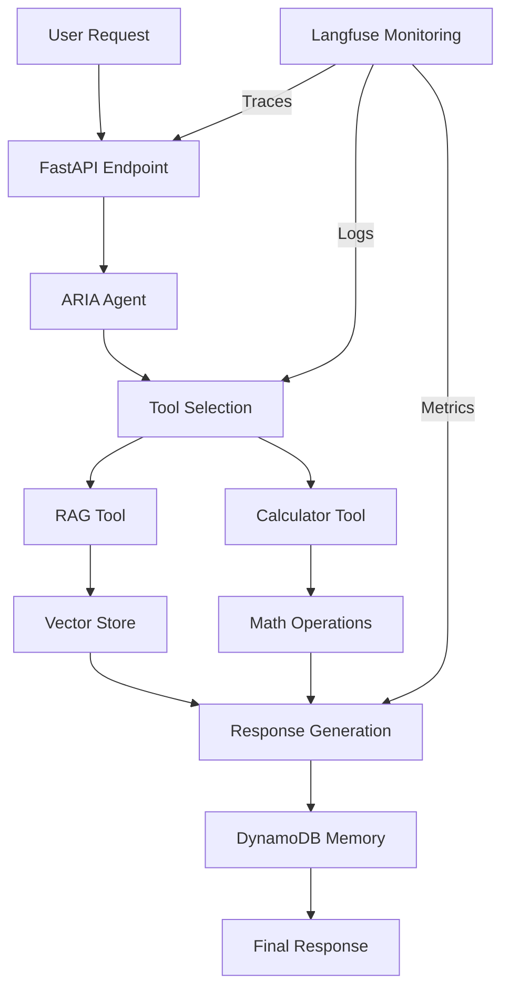

# FastAPI RAG Application with ARIA Agent

A FastAPI application that combines Retrieval Augmented Generation (RAG) with ARIA, an AI-powered maternal health assistant. The application uses pgvector for vector storage, DynamoDB for conversation memory, OpenAI's API for embeddings and text generation, and Langfuse for monitoring.

[Previous Project Structure section remains the same...]

## Prerequisites

- Python 3.9+
- AWS CDK CLI
- AWS CLI configured with appropriate credentials
- PostgreSQL database with pgvector extension
- DynamoDB access (local or AWS)
- Node.js and npm (for CDK)
- Administrator privileges on Windows
- OpenAI API key
- Langfuse account (for monitoring)

## Local Development

1. Open PowerShell as Administrator and navigate to your project directory:
   ```powershell
   # Run PowerShell as Administrator
   cd path\to\your\project
   ```

2. Create a development virtual environment in a location where you have write permissions:
   ```powershell
   # Create venv in your user directory
   python -m venv $env:USERPROFILE\venvs\rag-api
   # Activate the environment
   $env:USERPROFILE\venvs\rag-api\Scripts\Activate
   ```

3. Install dependencies:
   ```powershell
   pip install -r requirements.txt
   ```

4. Set up environment variables:
   ```powershell
   Copy-Item .env.example .env
   # Edit .env with your configuration
   ```

5. Set up local DynamoDB (optional):
   ```powershell
   # Install DynamoDB Local
   aws dynamodb create-table --cli-input-json file://dynamodb-table.json --endpoint-url http://localhost:8000
   ```

6. Run the application locally:
   ```powershell
   uvicorn app.main:app --reload
   ```

The API will be available at http://localhost:8000
API documentation is available at http://localhost:8000/docs

## API Endpoints

### RAG Operations

- `POST /api/v1/rag/query`
  - Query the RAG system with a question
  - Requires API Gateway key authentication
  - Example:
    ```bash
    curl -X POST https://your-api.execute-api.region.amazonaws.com/sbx/api/v1/rag/query \
      -H "x-api-key: your-api-gateway-key" \
      -H "Content-Type: application/json" \
      -d '{
        "query": "What are common pregnancy symptoms?",
        "collection_name": "maternal_health"
      }'
    ```

- `POST /api/v1/rag/ingest`
  - Ingest new documents into the vector store
  - Requires API Gateway key authentication
  - Example:
    ```bash
    curl -X POST https://your-api.execute-api.region.amazonaws.com/sbx/api/v1/rag/ingest \
      -H "x-api-key: your-api-gateway-key" \
      -H "Content-Type: application/json" \
      -d '{
        "urls": [
          "https://example.com/pregnancy-article",
          "https://example.com/maternal-health"
        ],
        "collection_name": "maternal_health"
      }'
    ```

### ARIA Operations

- `GET /api/v1/health`
  - Health check endpoint
  - No authentication required
  - Example:
    ```bash
    curl https://your-api.execute-api.region.amazonaws.com/sbx/api/v1/health
    ```
  - Response:
    ```json
    {
      "status": "healthy"
    }
    ```

- `POST /api/v1/aria/patient/chat`
  - Chat with ARIA, the maternal health assistant
  - Requires API Gateway key authentication
  - Monitored with Langfuse for conversation tracking
  - Example:
    ```bash
    curl -X POST https://your-api.execute-api.region.amazonaws.com/sbx/api/v1/aria/patient/chat \
      -H "x-api-key: your-api-gateway-key" \
      -H "Content-Type: application/json" \
      -d '{
        "patient_id": "patient123",
        "message": "What are safe exercises during pregnancy?",
        "history_limit": 5
      }'
    ```
  - Response:
    ```json
    {
      "response": "Based on current medical guidance...",
      "tools_used": ["search_maternal_health", "calculate"]
    }
    ```

- `POST /api/v1/aria/patient/reformulate`
  - Request ARIA to reformulate a previous response
  - Requires API Gateway key authentication
  - Monitored with Langfuse for response quality tracking
  - Example:
    ```bash
    curl -X POST https://your-api.execute-api.region.amazonaws.com/sbx/api/v1/aria/patient/reformulate \
      -H "x-api-key: your-api-gateway-key" \
      -H "Content-Type: application/json" \
      -d '{
        "patient_id": "patient123",
        "original_response": "Previous response about exercise...",
        "reformulation_type": "elaborate",
        "specific_focus": "first trimester exercises"
      }'
    ```
  - Response:
    ```json
    {
      "response": "Let me provide more detailed information...",
      "tools_used": ["search_maternal_health"]
    }
    ```

- `DELETE /api/v1/aria/patient/history/{patient_id}`
  - Clear conversation history for a specific patient
  - Requires API Gateway key authentication
  - Example:
    ```bash
    curl -X DELETE https://your-api.execute-api.region.amazonaws.com/sbx/api/v1/aria/patient/history/patient123 \
      -H "x-api-key: your-api-gateway-key"
    ```
  - Response:
    ```json
    {
      "status": "success",
      "message": "Chat history cleared"
    }
    ```

## Authentication

The API uses API Gateway's built-in key authentication:

1. API Key Location:
   - AWS Console > API Gateway > API Keys > {env}-aihub-api-key
   - Replace {env} with your environment (e.g., sbx, dev, prod)

2. Using the API Key:
   - Include in x-api-key header for all protected endpoints
   - Not required for health check endpoint (/api/v1/health)

3. Key Management:
   - Keys are environment-specific
   - Managed through API Gateway usage plans
   - Rate limiting and quota settings available

## Infrastructure

### DynamoDB Configuration

1. Table Naming:
   - Tables follow pattern: {env}-*
   - Example: sbx-jr-agent-langchain

2. Permissions:
   - Lambda has full CRUD permissions
   - Includes table and index access
   - Environment-scoped permissions

3. Operations:
   - Query
   - Scan
   - Get/Put Items
   - Batch operations
   - Table management

## Monitoring

### Langfuse Integration

The ARIA agent is monitored using Langfuse to track:
- Conversation flows
- Tool usage patterns
- Response quality
- Error rates
- Performance metrics

#### Setup

1. Create a Langfuse account at https://langfuse.com
2. Get your API keys from the Langfuse dashboard
3. Add keys to your .env file:
   ```
   LANGFUSE_PUBLIC_KEY=your-public-key
   LANGFUSE_SECRET_KEY=your-secret-key
   ```

#### Features

- Conversation Tracing:
  * Each patient interaction is traced
  * Tool usage is logged with inputs/outputs
  * Response generation is monitored
  * Errors are captured and tracked

- Metrics:
  * Response latency
  * Tool usage frequency
  * Error rates
  * Token usage

- Dashboard:
  * Real-time monitoring
  * Usage patterns
  * Error analysis
  * Performance trends

## AWS Deployment

### Prerequisites

1. Install required tools:
   ```bash
   # Install Node.js and npm (https://nodejs.org)
   # Install AWS CLI (https://aws.amazon.com/cli/)
   # Install AWS CDK CLI
   npm install -g aws-cdk
   ```

2. Configure AWS credentials:
   ```bash
   aws configure
   # Enter your AWS Access Key ID
   # Enter your AWS Secret Access Key
   # Enter your default region (e.g., us-east-1)
   # Enter your output format (e.g., json)
   ```

3. Verify AWS credentials:
   ```bash
   aws sts get-caller-identity
   ```

### Environment Setup

1. Create and configure .env file:
   ```env
   # AWS CDK Configuration
   CDK_DEFAULT_ACCOUNT=your-aws-account-id  # From 'aws sts get-caller-identity'
   CDK_DEFAULT_REGION=us-east-1
   ENVIRONMENT=sbx  # or dev, test, qa, prod
   ```

   Note: All other configuration values (OpenAI, PostgreSQL, etc.) are stored in AWS Secrets Manager under `{env}/aihub`.

### CDK Deployment Steps

1. Bootstrap AWS CDK (first time only):
   ```bash
   # This sets up the CDK toolkit stack in your AWS account
   cdk bootstrap aws://ACCOUNT-NUMBER/REGION
   ```

2. Install project dependencies:
   ```bash
   # Install main project dependencies
   pip install -r requirements.txt

   # Install CDK dependencies
   cd cdk
   pip install -r requirements.txt
   cd ..
   ```

3. Build Lambda package:
   ```powershell
   # Windows (PowerShell as Administrator)
   .\deploy\build_lambda.ps1

   # Linux/macOS
   chmod +x deploy/build_lambda.sh
   ./deploy/build_lambda.sh
   ```

4. Deploy the stack:
   ```powershell
   # Windows (PowerShell as Administrator)
   .\deploy\deploy.ps1

   # Linux/macOS
   chmod +x deploy/deploy.sh
   ./deploy/deploy.sh
   ```

### Infrastructure Created

The deployment creates:
- Lambda function with:
  * VPC networking for database access
  * Environment variables from AWS Secrets Manager
  * IAM roles and permissions
  * CloudWatch logging

- API Gateway with:
  * Environment-specific stage name (e.g., /sbx/, /dev/, /prod/)
  * REST API endpoints
  * API key authentication
  * CORS configuration
  * Usage plans and throttling

- DynamoDB:
  * Environment-specific conversation memory table
  * Auto-scaling configuration
  * Backup policies

### Post-Deployment Steps

1. Get deployment outputs:
   ```bash
   # Outputs saved to cdk-outputs.json
   cat cdk-outputs.json
   ```

2. Test the deployment:
   ```bash
   # Get API URL and key from cdk-outputs.json
   # Note: {env} will be sbx, dev, test, qa, or prod
   curl -X GET https://your-api.execute-api.region.amazonaws.com/{env}/api/v1/health
   ```

3. Monitor the deployment:
   - Check CloudWatch logs
   - View Langfuse dashboard
   - Monitor API Gateway metrics

### Troubleshooting

1. Check Lambda logs:
   ```bash
   # Replace {env} with your environment
   aws logs get-log-events --log-group-name /aws/lambda/{env}-aihub-api
   ```

2. Verify secrets access:
   ```bash
   # List secrets
   aws secretsmanager list-secrets

   # Get secret value (replace {env})
   aws secretsmanager get-secret-value --secret-id {env}/aihub
   ```

3. Test API Gateway:
   ```bash
   # Get API key (replace {env})
   aws apigateway get-api-keys --name-query {env}-aihub-api-key
   ```

4. Common issues:
   - VPC configuration: Ensure Lambda has proper network access
   - Secrets access: Verify Lambda role has permission to access {env}/aihub secret
   - Environment variables: Check CloudWatch logs for environment variable errors

## Architecture

The application uses a modern, scalable architecture:

### Components
- FastAPI for the API framework
- pgvector for vector similarity search
- DynamoDB for conversation memory
- OpenAI API for:
  * Embeddings generation
  * Text generation
  * Function calling
- AWS Lambda for serverless execution
- API Gateway for API management
- VPC for database connectivity
- Secrets Manager for sensitive data
- Langfuse for monitoring and analytics

### ARIA Agent Architecture


## Security

### Authentication & Authorization
- API Gateway key authentication for protected endpoints
- Public health check endpoint
- Secrets managed through AWS Secrets Manager
- Environment-based isolation for DynamoDB tables

### Network Security
- VPC isolation for database access
- HTTPS enforced through API Gateway
- Security groups for Lambda functions

### Data Protection
- Encryption at rest for DynamoDB
- Encryption in transit using HTTPS
- Secure handling of patient data
- Regular security audits

## Contributing

1. Fork the repository
2. Create a feature branch:
   ```bash
   git checkout -b feature/your-feature-name
   ```

3. Follow coding standards:
   - Use type hints
   - Add docstrings
   - Follow PEP 8
   - Write unit tests

4. Commit your changes:
   ```bash
   git commit -m "feat: add your feature description"
   ```

5. Push to your fork:
   ```bash
   git push origin feature/your-feature-name
   ```

6. Create a Pull Request:
   - Provide clear description
   - Link related issues
   - Include test results
   - Add documentation updates

## License

This project is licensed under the MIT License.

```
MIT License

Copyright (c) 2025 Emagine Solutions Technology

Permission is hereby granted, free of charge, to any person obtaining a copy
of this software and associated documentation files (the "Software"), to deal
in the Software without restriction, including without limitation the rights
to use, copy, modify, merge, publish, distribute, sublicense, and/or sell
copies of the Software, and to permit persons to whom the Software is
furnished to do so, subject to the following conditions:

The above copyright notice and this permission notice shall be included in all
copies or substantial portions of the Software.

THE SOFTWARE IS PROVIDED "AS IS", WITHOUT WARRANTY OF ANY KIND, EXPRESS OR
IMPLIED, INCLUDING BUT NOT LIMITED TO THE WARRANTIES OF MERCHANTABILITY,
FITNESS FOR A PARTICULAR PURPOSE AND NONINFRINGEMENT. IN NO EVENT SHALL THE
AUTHORS OR COPYRIGHT HOLDERS BE LIABLE FOR ANY CLAIM, DAMAGES OR OTHER
LIABILITY, WHETHER IN AN ACTION OF CONTRACT, TORT OR OTHERWISE, ARISING FROM,
OUT OF OR IN CONNECTION WITH THE SOFTWARE OR THE USE OR OTHER DEALINGS IN THE
SOFTWARE.
